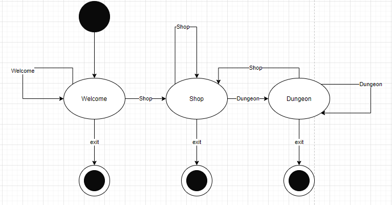

# FakeMapleStory

This is a DW assignment in replacement of the finals exam

- Dedicated to the millennials and pioneer generation Z out there who want to feel young again.
- This is a fake MapleStory version back when grinding is the thing. (like when I was in primary 2? The year 2006?) --with a twist of Singapore-ness and Pokemon memes -- Hope you like it.
- This is built with simple state machines and classes with public attributes in python.
- Due to assignment criteria, we need to write codes in a single file. I wish that we can separate it into different files. Writing 800 lines of code is so confusing.

<h2> Installation</h2>

Install libdw, a library by our SUTD course lead Oka Kurniawan. Downloading this package would allow us to use state machines.

Install numpy for normal distribution of monster levels

```python
pip install libdw
pip install numpy
```

---

## How it works a.k.a. GM's tips

This program uses state machines, classes and a lot of if-else statements to run. 

- The player is first asked to jot down his name and start the adventure. All classes except monsters are initiated.
- I used state machines to change location when needed. Below is the state diagram. I put an exit code as a secondary measure in get_next_values() on top of exiting right after the input just in case.



- I have five public classes: Shop, Dungeon, Player and Monster and Boss All classes have their distinct methods and they interact with one another. Hence, this is why I use public classes instead.
- To keep players entertained, I use varied and random conversations by using if-else statement and random.randint().
- Also, the damage inflicted, criticals, monster names and mesos earned are obtained using random.randint() function.
- The monster level is based on a normal distribution. This gives a slight chance for a higher/lower level monster
- Attacks are triggered when players choose the attack type and the program would find the correct method using getattr() function.
- To give elements of surprise, status and traps are set when attacks occur. 
- Experience gained due to the level of the monster. Killing monster may drop weapons to boost attack.
- After each level up, experience level would become zero and the experience needed to level up(explimit) increases exponentially.
- Stats are based on player's level and class.
- A health system is used to keep track of both players and monster health. This is done by using python class states.
- When the player dies, the experience level would decrease by 10% of explimit and he will return to town.
- When job advancement, the player gains new skills by triggering player.jobadvancement(). 
- Boss appears after fighting for a while. Boss drops would be better. The experience gained is much higher.
- If you are using windows, you can uncomment lines of code containing winsound module so that you can enjoy BGM.


## How to Play FakeMapleStory

FakeMapleStory is a primitive PvE game, where the player plays on the command prompt. Instructions in the command prompt are quite fool-proof, as the player just has to type in the numbers to proceed to the next steps. This game is about grinding for the level, and reliving millennials' childhood. 

To start the game, run main.py under fakemaplestory folder on command prompt. A new command prompt window at the full screen would be good.

```
./fakemaplestory>main.py
```

The player starts off as beginners.

Shop/Town: The Player can buy/sell potion at shops. When the player reaches level 10, the player would proceed to job advancement(Warrior, Magician, Thief, Bowman). The player can earn mesos to buy potions in the shop by fighting monsters.

Jobs

Each job has specific skills and different health. Warriors have the highest health while thieves have the highest attacks. Their stats vary from one to another.

Dungeon: This is the place that the player fights monsters. Monster chosen is random and difficulty is based on the player's level and normal distribution. Boss spawn once in a while

At any point, that player wants to quit, type "exit" or press crt-c.

Happy Mapling~


